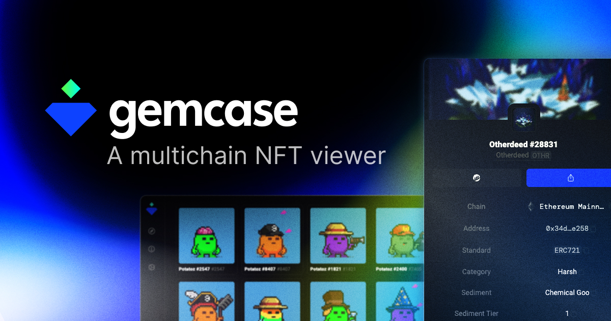

# gemcase
💎 A multichain NFT viewer

### What can I view exactly?

- addresses
- tokens (i.e. coins)
- NFT collections
- NFTs

Now only EVM chains are supported, but the plan is to add several blockchains (Aptos, Solana, NEAR) in the future. Viewing blocks and transactions may also appear in the future.

The list of currently supported chains:
- Ethereum Mainnet
- Goerli Testnet
- sepolia testnet
- Polygon
- Matic Mumbai Testnet
- Avalanche C-Chain
- Avalanche Fuji Testnet
- Palm
- Arbitrum One

### Tech stack

  
  
  
  
  
  

###### web3

  
  
  

###### styles

  
  

###### api

  
  
  

---

### hi, btw

If you like what you've seen in this repo and want to build something significant together, feel free to contact me on any link from [my profile](https://github.com/pyncz).

### etc

> Credit to [create-t3-app](https://github.com/t3-oss/create-t3-app) for the boilerplate.
